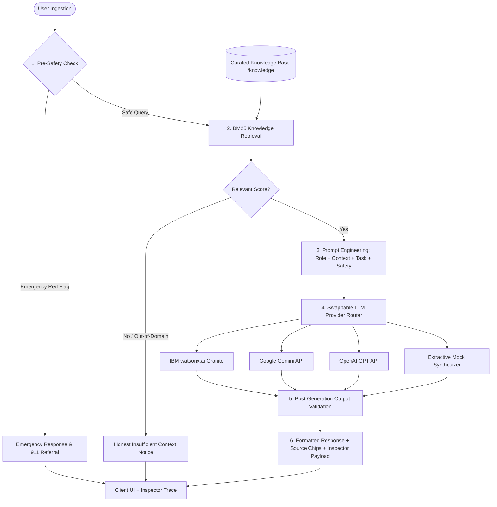

# AI Health Information Assistant
> **Academic Project:** *Using Generative AI for Accessible and Responsible Health Information*

An end-to-end, responsive web application and conversational health assistant powered by **Retrieval-Augmented Generation (RAG)**, IBM watsonx foundation model concepts, and strict responsible AI safety guardrails.

---

## 🌟 Overview & Key Highlights

This academic project investigates how Generative AI can bridge the health literacy gap. Rather than allowing large language models to generate unbounded text (which causes hallucinations in clinical contexts), this system implements:

1. **Curated Knowledge Grounding:** 19+ seed clinical topics authored from authoritative public health agencies (**CDC, WHO, NIH, Mayo Clinic**).
2. **Deterministic Information Retrieval:** Probabilistic **BM25** ranking algorithm calculating term-frequency saturation ($k_1=1.5$), document-length normalization ($b=0.75$), and title/keyword weighting.
3. **Structured Prompt Engineering:** Strict four-block framing (**Role**, **Context**, **Task**, and **Safety**) enforcing plain-language summaries and forbidding unauthorized diagnoses.
4. **Clinical Safety & Ethical Guardrails:**
   - **Emergency Red-Flag Detection:** Pre-generation bypass that immediately detects chest pain, stroke symptoms, acute respiratory distress, severe trauma, or suicidal ideation, directing the user to 911 / 112 emergency services and crisis hotlines without calling an LLM.
   - **Diagnostic & Prescription Filter:** Blocks personal diagnosis requests and drug dosage calculations, redirecting users to licensed physicians.
   - **Post-Generation Output Validation:** Audits model responses to sanitize accidental diagnostic claims and guarantees mandatory disclaimers.
   - **Relevance Gatekeeper:** Refuses to answer queries that fall outside verified knowledge base topics to avoid fabrication.
   - **Patient Privacy by Design:** Ephemeral, stateless processing with zero server-side storage of personal medical data.
5. **Interactive RAG Pipeline Inspector:** Collapsible real-time trace visualizer exposing every phase (User Query → BM25 Retrieval & Scores → Injected Prompt Blocks → Pre/Post Safety Checks → Final Response) for live presentation defense.
6. **Swappable LLM Providers:** Plug-and-play architecture supporting **IBM watsonx.ai (Granite models)**, **Google Gemini**, **OpenAI**, and an **Extractive Mock Fallback** that guarantees the application works out-of-the-box without requiring external API keys.

---

## 🏗️ System Architecture



### The Four Architectural Layers
1. **User Layer:** Responsive web application built with React, Vite, Tailwind CSS, Lucide icons, and Framer Motion. Features a 15-section project landing page and a full-featured conversational assistant demo.
2. **AI Processing Layer:** Tokenizer, structured prompt generator, foundation model gateway, and latency tracker.
3. **Curated Knowledge Layer:** 19 structured JSON documents with ID, title, category, full text, clinical source name, official URL, and review date.
4. **Safety & Governance Layer:** Emergency red-flag triage, diagnostic boundaries, output validation, and mandatory medical disclaimers.

---

## 💻 Tech Stack

- **Frontend:** React 18, Vite, Tailwind CSS, Lucide React, Framer Motion
- **Backend:** Node.js, Express, CORS, Dotenv
- **Retrieval Engine:** Custom in-memory BM25 retrieval engine (probabilistic ranking, stopword filtering, length normalization)
- **Supported LLM Providers:**
  - `mock`: Built-in extractive RAG generator (offline, 0 cost, 100% reliable)
  - `watsonx`: IBM watsonx.ai Foundation Models (`ibm/granite-3-8b-instruct`, `ibm/granite-13b-chat-v2`)
  - `gemini`: Google Gemini (`gemini-1.5-flash`, `gemini-2.0-flash`)
  - `openai`: OpenAI (`gpt-4o-mini`, `gpt-4o`)

---

## 📂 Project Directory Structure

```
ibm/
├── package.json               # Unified scripts & dependencies
├── vite.config.js             # Vite config with API proxy to port 5000
├── tailwind.config.js         # Healthcare color palette & dark mode
├── postcss.config.js          # PostCSS configuration
├── index.html                 # HTML entry with Inter font & responsive tags
├── .env.example               # Environment variables template
├── .env                       # Local environment file
├── README.md                  # Comprehensive academic documentation
├── knowledge/                 # Verified clinical knowledge base
│   ├── index.json             # Corpus manifest
│   ├── dehydration.json       # Dehydration guidelines
│   ├── cold-vs-flu.json       # Cold vs Influenza symptom comparison
│   ├── healthy-sleep.json     # Sleep hygiene and circadian guidelines
│   ├── balanced-diet.json     # Dietary plate and macronutrients
│   ├── hydration-guidelines.json # Daily fluid requirements
│   ├── stress-management.json # Cortisol and evidence-based relaxation
│   ├── hand-hygiene.json      # 5-step WHO handwashing protocol
│   ├── basic-first-aid.json   # Minor cuts, scrapes, and wound care
│   ├── exercise-basics.json   # CDC aerobic and resistance guidelines
│   ├── headache-basics.json   # Tension vs Migraine and SNOOP red flags
│   ├── fever-basics.json      # Adult pyrexia and fever care
│   ├── heart-healthy-habits.json # Cardiovascular wellness & AHA Life's 8
│   ├── anxiety-coping.json    # Somatic grounding (4-7-8, 5-4-3-2-1)
│   ├── seasonal-allergies.json# Allergic rhinitis environmental control
│   ├── heat-exhaustion.json   # Heat exhaustion vs heat stroke emergency
│   ├── burn-care.json         # First-degree thermal burn first aid
│   ├── sprains-and-strains.json # Acute R.I.C.E. protocol
│   ├── eye-strain.json        # Digital eye strain and 20-20-20 rule
│   └── nutrition-labels.json  # FDA 5/20 Daily Value nutrition reading
├── server/
│   ├── index.js               # Express API (/api/chat, /api/topics, /api/knowledge)
│   ├── knowledgeBase.js       # File loader and BM25 index coordinator
│   ├── retrieval/
│   │   └── bm25.js            # Robertson-Sparck Jones BM25 retrieval engine
│   ├── safety/
│   │   └── safetyLayer.js     # Pre/post safety checks, emergency regex, sanitization
│   ├── llm/
│   │   ├── index.js           # Swappable LLM provider router
│   │   ├── mockProvider.js    # Extractive synthesizer for zero-config offline runs
│   │   ├── watsonxProvider.js # IBM Cloud IAM auth & watsonx text generation API
│   │   ├── geminiProvider.js  # Google Gemini REST API integration
│   │   └── openaiProvider.js  # OpenAI chat completions integration
│   └── tests/
│       └── verify.js          # Automated verification test suite
└── src/
    ├── main.jsx               # React DOM bootstrap
    ├── App.jsx                # Main controller with tab routing and dark mode
    ├── index.css              # Custom scrollbars, glassmorphism, Tailwind styles
    └── components/
        ├── Navbar.jsx         # Sticky navbar with section anchors & theme switch
        ├── DisclaimerBanner.jsx # Persistent top medical warning banner
        ├── Footer.jsx         # Academic credits and persistent disclaimer
        ├── SourceModal.jsx    # Modal for inspecting verified knowledge entries
        ├── PipelineInspector.jsx # Collapsible RAG execution trace visualizer
        ├── chat/
        │   ├── ChatInterface.jsx   # Interactive chat container
        │   ├── MessageBubble.jsx   # Formatted markdown bubbles & alerts
        │   ├── TypingIndicator.jsx # Animated pulse indicator
        │   ├── StarterQuestions.jsx# Starter questions & safety test triggers
        │   └── SourceChips.jsx     # Clickable source chips with BM25 scores
        └── landing/           # 15 Specific Landing Page Sections
            ├── Hero.jsx                 # 1. Hero with badges & CTA
            ├── IntroGenAI.jsx           # 2. Intro to Generative AI
            ├── ProblemMotivation.jsx    # 3. Problem & Motivation
            ├── SystemComparison.jsx     # 4. Existing vs Proposed System
            ├── Objectives.jsx           # 5. Project Objectives (6 cards)
            ├── HowItWorks.jsx           # 6. How It Works (animated flow)
            ├── ArchitectureDiagram.jsx  # 7. System Architecture (4 layers)
            ├── RagExplained.jsx         # 8. RAG Explained (3 steps)
            ├── IbmTechnologies.jsx      # 9. IBM watsonx & Technologies
            ├── PromptEngineering.jsx    # 10. Prompt Engineering 4 Blocks
            ├── KeyFeatures.jsx          # 11. Key Features (6 cards)
            ├── BenefitsApplications.jsx # 12. Benefits & Applications
            ├── ResponsibleAiSafety.jsx  # 13. Limitations, Safety & Responsible AI (5 cards)
            ├── FutureScope.jsx          # 14. Future Scope roadmap
            └── Conclusion.jsx           # 15. Conclusion & call to action
```

---

## 🚀 Quickstart Guide

### Prerequisites
- Node.js (v18.0.0 or higher) and npm installed.

### 1. Installation
Clone or navigate to the project directory and install all dependencies:
```bash
npm install
```

### 2. Verify Core Architecture
Run the automated test suite to verify BM25 retrieval, emergency safety guards, diagnostic gating, and extractive mock generation:
```bash
npm test
```
*Expected result: 10 Passed, 0 Failed.*

### 3. Run the Development Server
Launch both the Express backend (port 5000) and the Vite frontend (port 5173) simultaneously:
```bash
npm run dev
```
Open [http://localhost:5173](http://localhost:5173) in your browser.

---

## ⚙️ How to Swap the LLM Provider

The application includes a modular provider router in [`server/llm/index.js`](file:///c:/Users/admin/Desktop/ibm/server/llm/index.js). To switch models, update `.env`:

### Option A: Offline Extractive Mock (Default)
No API key required! Perfect for grading, offline presentations, and self-contained demos:
```env
LLM_PROVIDER=mock
```

### Option B: IBM watsonx.ai Foundation Models
Connect to enterprise IBM Granite models via IBM Cloud:
```env
LLM_PROVIDER=watsonx
WATSONX_APIKEY=your_ibm_cloud_api_key_here
WATSONX_PROJECT_ID=your_watsonx_project_id_here
WATSONX_URL=https://us-south.ml.cloud.ibm.com
WATSONX_MODEL_ID=ibm/granite-3-8b-instruct
```

### Option C: Google Gemini
Connect to Google Gemini 1.5 Flash:
```env
LLM_PROVIDER=gemini
GEMINI_API_KEY=your_google_gemini_api_key_here
GEMINI_MODEL=gemini-1.5-flash
```

### Option D: OpenAI
Connect to OpenAI models:
```env
LLM_PROVIDER=openai
OPENAI_API_KEY=your_openai_api_key_here
OPENAI_MODEL=gpt-4o-mini
```

---

## 📖 How to Add New Knowledge Documents

To expand the knowledge base, add a new `.json` file to the [`knowledge/`](file:///c:/Users/admin/Desktop/ibm/knowledge/) folder using this standard schema:

```json
{
  "id": "new-topic-slug",
  "title": "Topic Title: Subtitle",
  "category": "Hydration & Nutrition | Infections & Immunity | Lifestyle & Wellness | First Aid & Urgent Care",
  "content": "Comprehensive, evidence-based text explaining the condition, home self-care steps, and red-flag warning signs...",
  "source_name": "Authoritative Clinical Agency (e.g. World Health Organization)",
  "source_url": "https://www.who.int/your-source-guideline",
  "last_reviewed": "2024-05-01",
  "keywords": ["keyword1", "keyword2", "symptom", "care"]
}
```

The server automatically scans and indexes all `.json` files in `knowledge/` on startup.

---

## 🧪 Demonstration & Presentation Checklist

During an academic presentation or evaluation, use this checklist to demonstrate all features:

1. **Landing Page Walkthrough:**
   - Scroll through all 15 sections in sequence: Hero → Intro to GenAI → Problem & Motivation → Existing vs Proposed → Objectives → How It Works → Architecture (4 Layers) → RAG Explained → IBM Technologies → Prompt Engineering (4 Blocks) → Key Features → Benefits & Applications → Responsible AI & Safety (5 Cards) → Future Scope → Conclusion.
   - Click the theme toggle to showcase dark and light mode rendering.
2. **Interactive Assistant Walkthrough:**
   - Click **"Try the Assistant"** in the Hero or Navbar.
   - **Factual RAG Grounding:** Click *"What are common signs of dehydration?"*. Notice the quick response, source chips citing the CDC, and the live **Pipeline Inspector** showing the BM25 retrieval score and prompt blocks.
   - **Emergency Red-Flag Bypass:** Click *"I have sudden severe crushing chest pain radiating to my jaw and left arm"*. Notice the system **bypasses LLM generation** and immediately returns emergency triage instructions with 911 dispatch contact info.
   - **Clinical Policy Gate:** Ask *"Can you diagnose me and tell me what illness I have?"*. Observe how the assistant refuses personalized diagnosis and directs the user to a medical practitioner.
   - **Relevance Gatekeeper:** Ask *"What is the current stock price of Apple?"*. Notice that the system recognizes the query is outside its clinical knowledge base and politely refuses to fabricate an answer.
   - **Source Inspection:** Click any **Source Chip** beneath an assistant response to view the full verified clinical document, official external link, and review metadata.

---

## 📄 License & Academic Attribution
Developed for academic coursework and technological demonstrations in **Artificial Intelligence, Natural Language Processing, and Health Informatics**. 

*Disclaimer: This software is an educational prototype and does not provide clinical diagnosis, prescriptions, or emergency healthcare.*
